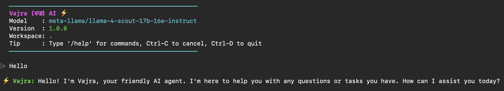
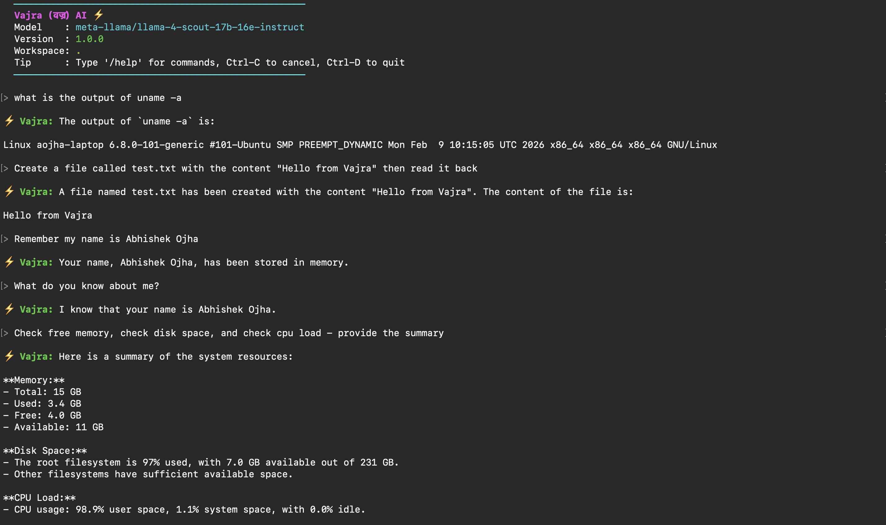
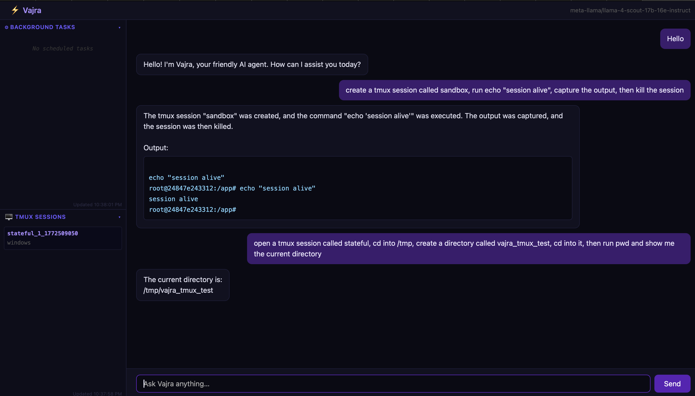
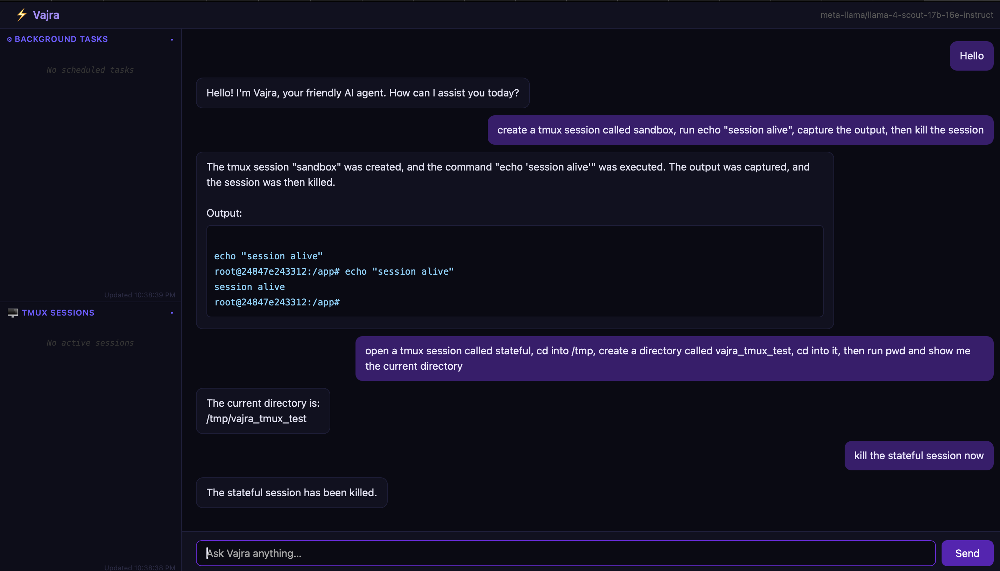

```markdown
> AI agent written in C. Runs an agentic loop against any LLM — local via Ollama or remote via any OpenAI-compatible API. It all started as a weekend fun project and now it started to crawl.
```

---

## Build & Run

```bash
sudo apt-get install -y build-essential cmake libcurl4-openssl-dev libreadline-dev

mkdir build && cd build
cmake -DCMAKE_BUILD_TYPE=Release ..
make -j$(nproc)
cd ..

./build/bin/aham
```

See **[QUICK_START.md](QUICK_START.md)** for all options: Docker, remote providers.

---

## Requirements

| Dependency | Notes |
|---|---|
| GCC ≥ 9 / Clang ≥ 10 | C17 |
| CMake ≥ 3.16 | |
| libcurl | `libcurl4-openssl-dev` |
| libreadline *(optional)* | Line editing in CLI |
| Ollama *(optional)* | Only needed for local LLM mode |

---

## Screenshots

 | 

 | 

## What's implemented

| Feature | Status |
|---|---|
| Agentic loop | ✅ |
| Ollama provider | ✅ |
| OpenAI-compatible providers | ✅ |
| Shell execution | ✅ |
| Persistent memory | ✅ |
| Serial device control | ✅ |
| Skills system | ✅ |
| Scheduler | ✅ |
| tmux integration | ✅ |
| HTTP gateway + web UI | ✅ |
| History compaction | ✅ |

---

## Configuration

`aham.conf`:

```ini
[provider]
type  = ollama
model = mistral-nemo:12b

[gateway]
port = 8080

[agent]
max_iterations = 10
max_messages   = 0

[paths]
workspace = .
templates = templates

[security]
allowlist = allowlist.conf
```
---

## License

[MIT](LICENSE)

## References

```markdown
This project is inspired by [nanobot](https://github.com/HKUDS/nanobot).
```
